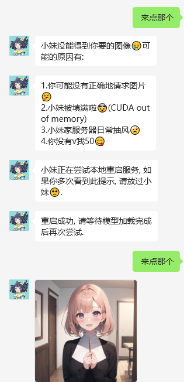

#### 更新：0.2

现在。自己要求的读图只在当前会话中，自己能用，与别人可以同时发起，不会冲突。OCR状态也更改为当前会话有效，且可以设置默认是否有效。对比0.1版本中，发起一次请求，在别的群或私聊中，别人也能用，且多次发起会冲突。OCR状态为全局。

---
# Readim插件：微信Bot读取图像内容和文字


## 插件描述

本插件用于使机器人可以阅读图像中的内容和文字。

本插件基于[chatgpt-on-wechat](https://github.com/zhayujie/chatgpt-on-wechat). 但本人偏离主仓库太多，可能存在兼容性错误。

## 环境要求

```
sudo apt-get update
sudo apt-get install tesseract-ocr

pip install pytesseract Pillow
```

根据需求安装语言，具体参照[tesseract-ocr/tesseract](https://github.com/tesseract-ocr/tesseract)

```
sudo apt-get install tesseract-ocr-chi-sim  # 简体中文
sudo apt-get install tesseract-ocr-chi-tra  # 繁体中文
```

如果你打算使用和我一样的本地blip2：

```
pip install git+https://github.com/huggingface/transformers.git
pip install accelerate
```

本地使用blip2需要10G左右的显存或内存，cpu运行耗时尚可接受，但推荐使用gpu可以实现实时回复。

如果和sdwebui同时使用，插件提供了每次用完模型将模型转移到内存中的功能，即看图时才占用显存，不与绘画占显存冲突。但正在绘图时启用看图会抢显存报错。我给出一个解决方法：写一个bash脚本单独用于启动webui，然后再相关地方捕捉显存错误，用subprocess杀死卡住的webui并且重启，如图：



## 使用说明

直接下载本仓库再plugin文件夹中。处于demo阶段，暂不pr到主仓库。请将`config.json.template`复制为`config.json`。

参数说明：

  `lang`: ocr支持的语言。

  `prefix_verb`: 触发接受图片的动词。

  `prefix_noun `: 触发接受图片的名词，与动词一起输入时，接受一次图片收入。我的常用：`看看这个`，`读这个`，`看这个图`，可自定义。

 `always_read_image` : 是否接受每张图片，无视动名词组合。

`model`: 使用的视觉模型

`free_cuda_memory`: 是否每次搬运模型到cpu

此外，使用`开启/关闭ocr`（直接发送消息）控制是否打开ocr

### 效果展示


## 协助开发

已经在model.py中写好了接口，只需使用你的方法重写类的`caption_image`

